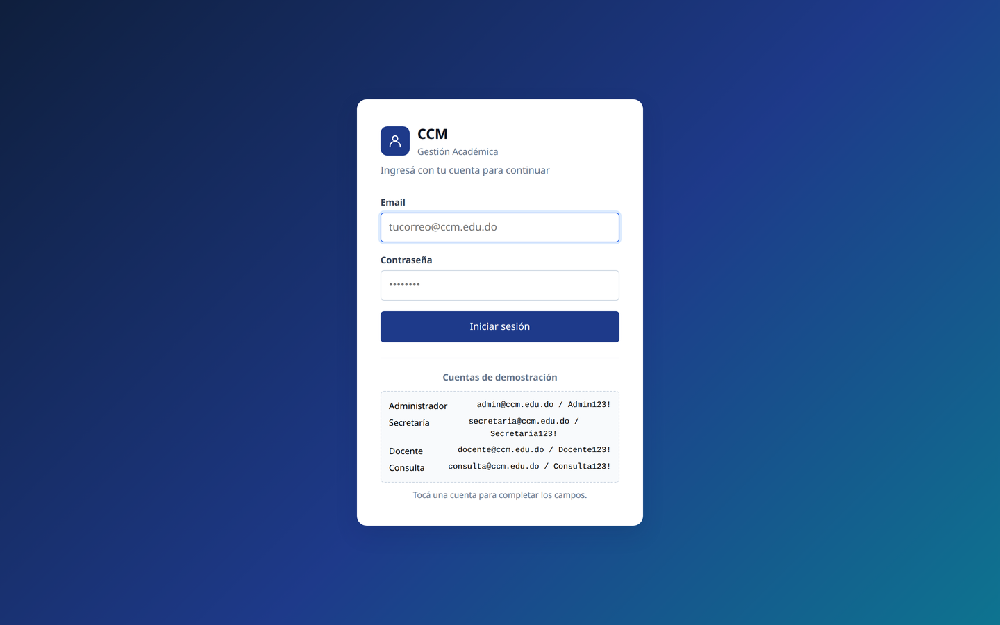
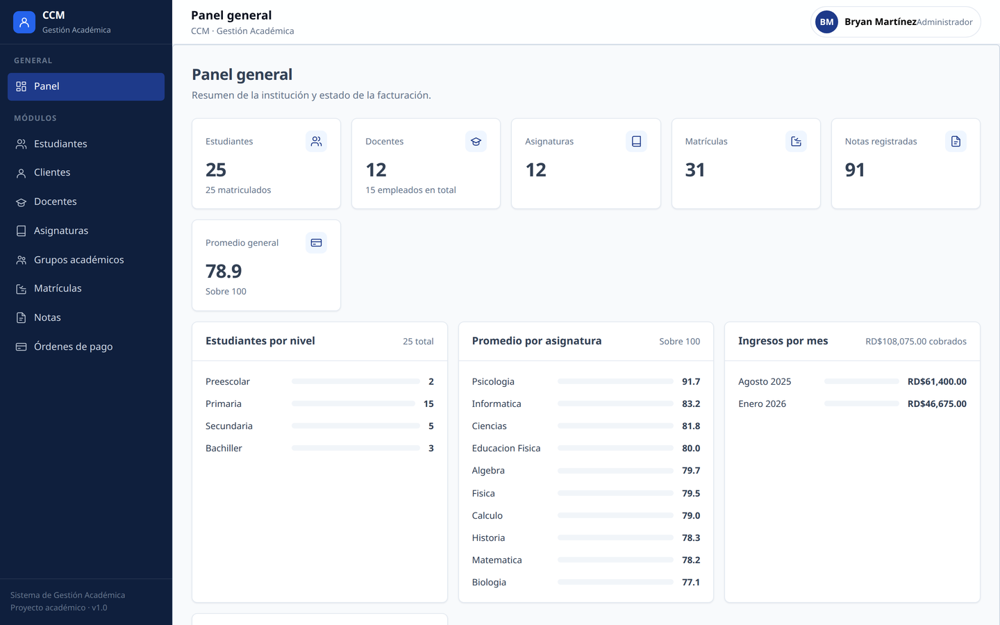
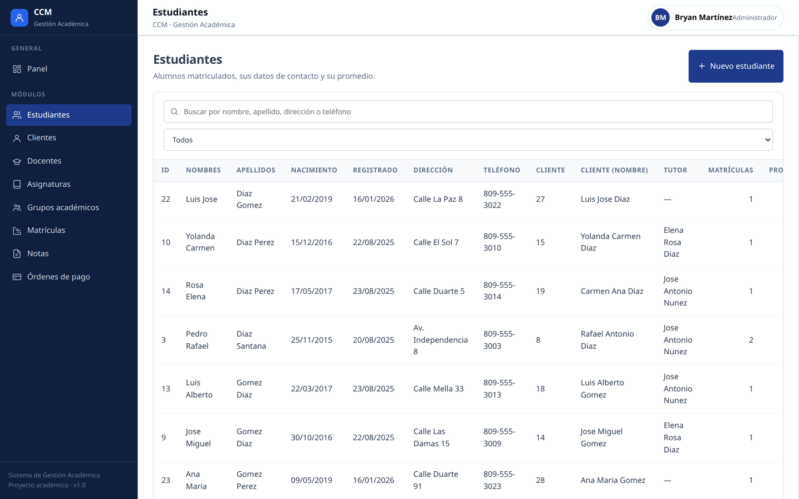
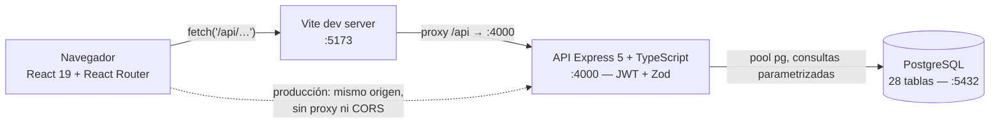

<p align="center">
  
</p>

<h1 align="center">CCM — Sistema de Gestión de Instituciones Educativas</h1>

<p align="center">
  Aplicación web full-stack para gestionar el ciclo académico completo:
  estudiantes, docentes, grupos, matrículas, notas y pagos.
</p>

<p align="center">
  <a href="https://img.shields.io/badge/Node.js-22.x-339933?style=flat&logo=node.js&logoColor=white"></a>
  <a href="https://img.shields.io/badge/TypeScript-5.9-3178C6?style=flat&logo=typescript&logoColor=white"></a>
  <a href="https://img.shields.io/badge/React-19-61DAFB?style=flat&logo=react&logoColor=black"></a>
  <a href="https://img.shields.io/badge/Vite-8-646CFF?style=flat&logo=vite&logoColor=white"></a>
  <a href="https://img.shields.io/badge/Express-5-000000?style=flat&logo=express&logoColor=white"></a>
  <a href="https://img.shields.io/badge/PostgreSQL-18-4169E1?style=flat&logo=postgresql&logoColor=white"></a>
  <a href="#pruebas"></a>
  <a href="LICENSE"></a>
</p>

---

## Capturas

| Pantalla de acceso | Panel general |
|---|---|
|  |  |

<p align="center">
  
</p>

## Características

- **Autenticación con JWT** — login con bcrypt, token de 8 horas y cuatro roles
  (Administrador, Secretaría, Docente, Consulta) con control de escritura.
- **8 módulos de datos** — estudiantes, clientes, docentes, asignaturas, grupos,
  matrículas, notas y órdenes de pago.
- **CRUD genérico parametrizado** — el listado paginado con búsqueda, filtros y
  orden, el alta, la edición y el borrado protegido se definen **una sola vez**
  (`server/src/lib/crud.ts`) y se parametrizan por módulo: 40 endpoints salen
  de una sola implementación.
- **Panel general** con tarjetas de resumen y gráficos: estudiantes por nivel,
  promedio por asignatura, ingresos por mes y órdenes de pago.
- **Validación de punta a punta** — esquemas Zod en la API (errores `422` con el
  nombre del campo) y tipos compartidos en el cliente.
- **Seguridad** — Helmet, CORS restringido al origen de Vite, SQL siempre
  parametrizado (`pg`), límite de payload de 1 MB y borrado protegido por rol.
- **Calidad** — 135 pruebas, lint, formato, typecheck y build verificables con
  un solo comando.

## Arquitectura



El frontend **no tiene URL de API propia**: pide rutas relativas `/api/…` y, en
desarrollo, el proxy de Vite las reenvía a `http://localhost:4000`. Así no hay
CORS ni configuración distinta entre desarrollo y producción.

## Stack tecnológico

| Capa | Tecnología |
|---|---|
| Frontend | React 19, React Router 7, Vite 8, TypeScript 5.9, CSS propio |
| Backend | Node.js 22, Express 5, TypeScript 5.9 (ESM) |
| Base de datos | PostgreSQL 18, driver `pg` con pool y transacciones |
| Autenticación | JSON Web Token (`jsonwebtoken`) + `bcryptjs` |
| Validación | Zod 4 |
| Seguridad | Helmet, CORS, SQL parametrizado |
| Pruebas | Vitest + Testing Library (cliente), Vitest + Supertest (API) |
| Calidad | ESLint 10, Prettier, `tsc --noEmit` |

## Estructura del repositorio

```
sistemadb/
├── client/                Frontend — React 19 + Vite (:5173)
│   └── src/
│       ├── api/           cliente HTTP y tipos compartidos
│       ├── componentes/   Tabla, Formulario, Modal, Layout, Alerta…
│       ├── config/        catálogo de los 8 módulos (columnas, filtros, rutas)
│       ├── contexto/      AuthContext (JWT), CatalogosContext
│       ├── paginas/       Login, Panel, Modulo, NoEncontrada
│       └── pruebas/       71 pruebas (Vitest + jsdom)
├── server/                API — Express 5 + TypeScript (:4000)
│   └── src/
│       ├── routes/        auth, dashboard, catálogos, módulos
│       ├── lib/           crud.ts (CRUD genérico), validate, ApiError
│       ├── middleware/    requiereAuth (JWT), errorHandler
│       └── db/            pool de conexión y transacciones
├── db/                    schema.sql (28 tablas), seed.sql, migrations/
├── scripts/               instalar.sh, verificar.sh
├── docs/screenshots/      capturas usadas en este README
├── ccm.sql                volcado SQL original (pg_dump de PostgreSQL 18)
└── use.txt                guía detallada de compilación y ejecución
```

> **Nota histórica:** CCM nació como aplicación de escritorio en C# / Windows
> Forms sobre SQL Server. Este repositorio es su **reescritura web** sobre
> PostgreSQL: conserva el mismo esquema de 28 tablas, pero el código original
> de WinForms no forma parte del repositorio.

## Requisitos

| Requisito | Versión |
|---|---|
| Node.js | 22 (fijado en `.nvmrc`) |
| npm | 10+ |
| PostgreSQL | 18 (activo en `127.0.0.1:5432`) |

No hace falta Docker: PostgreSQL corre nativo.

## Puesta en marcha

Todo desde la raíz del proyecto:

```bash
# 1. Dependencias de server/ y client/ (npm ci en cada uno)
./scripts/instalar.sh

# 2. Variables de entorno de la API
cp server/.env.example server/.env
#    completar DB_PASSWORD y JWT_SECRET (ver nota abajo)
chmod 600 server/.env

# 3. Base de datos: crea el esquema (28 tablas) y carga datos de demo
./db/reset-db.sh                # con datos
./db/reset-db.sh --no-seed      # solo esquema

# 4. API — terminal 1
cd server && npm run dev        # http://localhost:4000

# 5. Interfaz — terminal 2
cd client && npm run dev        # http://localhost:5173
```

Abre **http://localhost:5173** e ingresa con una cuenta de demostración.

<details>
<summary><b>Generar el <code>JWT_SECRET</code> y preparar el rol de PostgreSQL</b></summary>

```bash
# Secreto para firmar los tokens
node -e "console.log(require('crypto').randomBytes(48).toString('hex'))"

# El rol necesita CREATEDB para que reset-db.sh pueda recrear la base (una sola vez)
sudo -u postgres psql -c "CREATE ROLE <TU_USUARIO> LOGIN PASSWORD '<CLAVE>' CREATEDB;"
```

`server/.env` está en `.gitignore`: nunca lo subas al repositorio.
</details>

### Build de producción

```bash
cd server && npm run build && npm start          # API desde server/dist
cd client && npm run build && npm run preview    # UI en http://localhost:4173
```

## Scripts

| Script | Qué hace |
|---|---|
| `./scripts/instalar.sh` | `npm ci` en `server/` y `client/` |
| `./scripts/verificar.sh` | typecheck + lint + formato + pruebas + build + humo de la API |
| `./scripts/verificar.sh --rapido` | lo mismo, omitiendo pruebas y build |
| `./db/reset-db.sh` | borra y recrea la base, aplica `schema.sql` y `seed.sql` |
| `./db/reset-db.sh --no-seed` | solo el esquema, sin datos de demostración |

## API

Todas las rutas cuelgan de `/api`. El token se envía en
`Authorization: Bearer <JWT>`.

| Método | Ruta | Acceso | Descripción |
|---|---|---|---|
| GET | `/api/health` | pública | estado de la API y de la conexión a la BD |
| POST | `/api/auth/login` | pública | inicio de sesión, devuelve el JWT |
| GET | `/api/auth/yo` | token | usuario del token actual |
| GET · POST | `/api/auth/usuarios` | token | listado y alta de usuarios |
| GET | `/api/dashboard` | token | resumen del panel |
| GET | `/api/catalogos` | token | catálogos para los formularios |
| GET | `/api/:modulo` | token | listado paginado con búsqueda, filtros y orden |
| GET | `/api/:modulo/:id` | token | detalle de un registro |
| POST | `/api/:modulo` | token + rol escritura | alta |
| PATCH | `/api/:modulo/:id` | token + rol escritura | edición |
| DELETE | `/api/:modulo/:id` | token + rol escritura | borrado (con `?cascade=1` cuando aplica) |

`:modulo` ∈ `estudiantes` · `clientes` · `docentes` · `asignaturas` ·
`grupos` · `matriculas` · `notas` · `pagos` → **47 endpoints** en total.

## Cuentas de demostración

Vienen de `db/seed.sql` y aparecen en la pantalla de acceso (toca una cuenta
para autocompletar los campos):

| Rol | Email | Contraseña |
|---|---|---|
| Administrador | `admin@ccm.edu.do` | `Admin123!` |
| Secretaría | `secretaria@ccm.edu.do` | `Secretaria123!` |
| Docente | `docente@ccm.edu.do` | `Docente123!` |
| Consulta | `consulta@ccm.edu.do` | `Consulta123!` |

## Pruebas

```bash
cd server && npm test     # 64 pruebas — integración de la API con Supertest
cd client && npm test     # 71 pruebas — componentes, formato y cliente HTTP
```

Estado verificado: **135 pruebas pasando** (7 archivos), además de typecheck,
ESLint, Prettier y build en ambos paquetes. Ejecutá `./scripts/verificar.sh`
para comprobarlo todo junto.

## Licencia

Distribuido bajo la [Licencia MIT](LICENSE) — © 2025 Manzanares.Ste2005.
